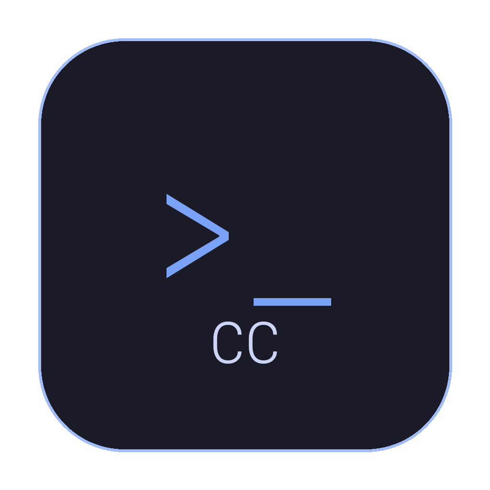

# Claude Code Desktop (Archived)

> **This project has been superseded by [Code Harness](https://github.com/koach08/code-harness).** All new development and features are in Code Harness.

---

**Code Harness** includes everything from Claude Code Desktop plus:
- Multi-AI support (Claude Code + Codex + Aider)
- Harness Engineering UI (CLAUDE.md editor, Hooks, Memory, Projects)
- 13 languages (i18n)
- Pro features with license system
- And more

**[Download Code Harness](https://github.com/koach08/code-harness/releases)**

---

*Original description below for reference:*

A user-friendly desktop interface for [Claude Code CLI](https://docs.anthropic.com/en/docs/claude-code).

Non-engineers and engineers alike can use Claude Code through an intuitive GUI — no terminal experience required.



## Features

- **Auto-launch Claude Code** — Opens Claude Code immediately on startup
- **Claude / Terminal toggle** — Switch between Claude Code and a regular terminal
- **Simple / Advanced UI modes** — Simplified interface for non-engineers, compact mode for engineers
- **Multi-tab sessions** — Run multiple Claude Code or terminal sessions simultaneously
- **Drag & drop folders** — Drop a project folder to open Claude Code in that directory
- **Rich text input** — Edit prompts freely with cursor positioning (unlike raw terminal)
- **Command reference sidebar** — All Claude Code commands and keyboard shortcuts at a glance
- **Quick action buttons** — One-click Yes/No/Ctrl+C for tool approvals
- **Status bar** — Real-time activity indicator (reading files, editing, waiting for approval...)
- **Session auto-save** — Sessions are saved automatically and can be restored on restart
- **CLI auto-detection** — Checks for Claude Code CLI and guides installation if missing

## Supported Platforms

| Platform | Format | Architecture |
|----------|--------|-------------|
| **macOS** | `.dmg` | Apple Silicon (M1-M4) / Intel |
| **Windows** | `.exe` (installer + portable) | x64 |
| **Linux** | `.AppImage` / `.deb` | x64 |

## Prerequisites

- **Node.js** v18+ ([nodejs.org](https://nodejs.org))
- **Claude Code CLI** (`npm install -g @anthropic-ai/claude-code`)
- **Anthropic account** (Pro plan or API key)

> The app checks for Claude Code CLI on startup and guides you through installation if needed.

## Install

### Option 1: Download (Recommended)

Download the latest release for your platform from [Releases](https://github.com/koach08/claude-code-desktop/releases).

- **macOS**: Open `.dmg`, drag to Applications
- **Windows**: Run `.exe` installer, or use the portable version
- **Linux**: Run `.AppImage` directly, or install `.deb`

### Option 2: Build from source

```bash
git clone https://github.com/koach08/claude-code-desktop.git
cd claude-code-desktop
npm install
npm start
```

Build for your platform:

```bash
npm run build:mac    # macOS (.dmg)
npm run build:win    # Windows (.exe)
npm run build:linux  # Linux (.AppImage, .deb)
```

## Keyboard Shortcuts

| Shortcut | Action |
|----------|--------|
| `Cmd+Enter` | Send input |
| `Cmd+T` | New tab |
| `Cmd+W` | Close tab |
| `Cmd+1-9` | Switch tabs |
| `Alt+↑↓` | Input history |

## Claude Code Commands

| Command | Description |
|---------|-------------|
| `/help` | Show help |
| `/clear` | Clear conversation |
| `/compact` | Summarize and compress conversation |
| `/cost` | Show token usage and cost |
| `/model` | Change AI model |
| `/review` | Request code review |

## Architecture

Each user runs Claude Code with **their own Anthropic account**. This app is a UI wrapper — no API keys are stored or shared.

## License

MIT

## Author

[Language × AI Lab](https://www.language-smartlearning.com/)
