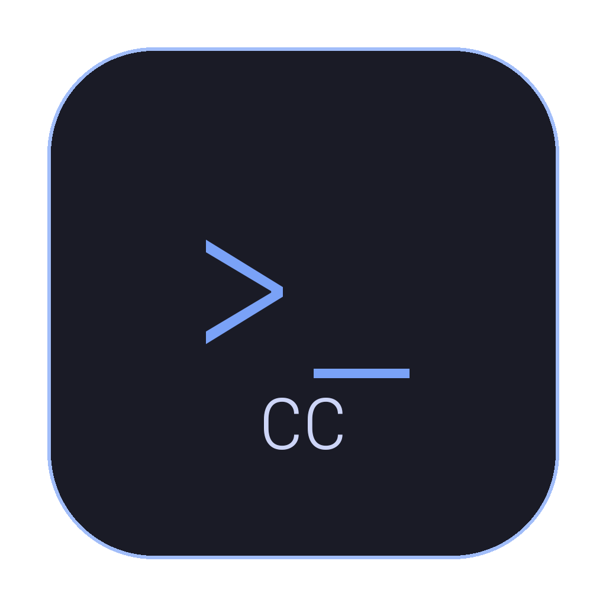

# Ariya Bridge 開発エージェント

**あなたと AI の開発チームをつなぐ、デスクトップの開発エージェント。**

Ariya Bridge は Claude Code / Codex / Gemini をひとつのウィンドウで束ね、
案件ごとにエンジンを切り替え、出荷まで面倒を見るための macOS / Windows / Linux アプリです。
ターミナルに不慣れでも、GUI から AI コーディングエージェントを動かせます。

> 旧称 **Claude Code Desktop**。単一エンジンの GUI ラッパーから、
> 複数エンジンを役割分担させる「AI の開発会社」へと発展させています。
> 方針は [VISION.md](VISION.md) を参照。



## 特長

- **マルチエンジン** — Claude Code / Codex / Gemini / 素のターミナルをタブごとに選択・切替
- **エンジン判定** — タスク文を渡すと、設計は Claude・リファクタは Codex・量産/UI は Gemini と推奨（`suggest-engine`）
- **タブのエンジンだけ再起動** — `Cmd+Shift+R` でアプリ全体を落とさず、そのタブのエンジンだけ入れ替え
- **タブ自動命名** — 作業フォルダ / プロジェクト名から読みやすいタブ名を自動生成
- **フォルダ D&D** — プロジェクトフォルダをドロップして、そのディレクトリでエージェントを起動
- **出荷プラン生成** — 作業フォルダの構成から配布先（iOS / Mac App Store / Gumroad / Vercel）を判定し `RELEASE.md` を書き出し
- **CLI 自動更新** — 起動時に Codex / Gemini CLI をバックグラウンドで更新
- **AI Hub** — チャット / 音声文字起こし / ルート提案を内蔵
- **Harness 編集** — CLAUDE.md・Hooks・Memory・Projects をアプリから編集
- **セッション自動保存 / 復元** — 再起動しても会話を `--resume` で復元
- **クイック承認** — Yes / No / Ctrl+C をワンクリック

## 対応プラットフォーム

| Platform | Format | Architecture |
|----------|--------|-------------|
| **macOS** | `.dmg` | Apple Silicon (M1-M4) / Intel |
| **Windows** | `.exe`（installer + portable） | x64 |
| **Linux** | `.AppImage` / `.deb` | x64 |

## 必要環境

- **Node.js** v18+（[nodejs.org](https://nodejs.org)）
- **Claude Code CLI**（`npm install -g @anthropic-ai/claude-code`）
- 任意: **Codex CLI** / **Gemini CLI**（該当レーンを使う場合）
- **Anthropic アカウント**（Pro プラン または API キー）

> 各エンジンは利用者自身のアカウントで動作します。本アプリは UI ラッパーであり、
> API キーの保存・共有は行いません。

## ビルド / 起動

```bash
git clone https://github.com/koach08/claude-code-desktop.git
cd claude-code-desktop
npm install
npm start
```

配布ビルド:

```bash
npm run build:mac    # macOS (.dmg)
npm run build:win    # Windows (.exe)
npm run build:linux  # Linux (.AppImage, .deb)
```

## キーボードショートカット

| ショートカット | 動作 |
|----------|--------|
| `Cmd+Enter` | 送信 |
| `Cmd+T` | 新規タブ |
| `Cmd+W` | タブを閉じる |
| `Cmd+Shift+R` | このタブのエンジンだけ再起動 |
| `Cmd+1-9` | タブ切替 |
| `Alt+↑↓` | 入力履歴 |

## アーキテクチャ

Electron メインプロセス（`main.js`）が各エンジンを `node-pty` で起動し、
レンダラー（`src/`）が xterm ベースの端末とサイドバー UI を提供します。
`api-server/` は補助的な API サーバーです。

## ライセンス

MIT

## Author

[Language × AI Lab](https://www.language-smartlearning.com/)
